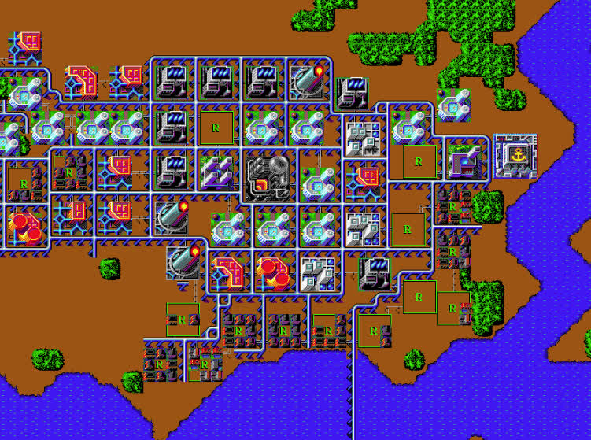

# MicroCity

Classic city simulation based on Micropolis

Demo: [https://eliot-akira.github.io/microcity](https://eliot-akira.github.io/microcity)

## Play

- Use arrow keys to navigate map
- Game state is saved to local storage automatically

## Develop

- Generate new city
- Export/import city
- Control panel with tool icons
- Macintosh-style scroll bar for map

## Reference

- [Micropolis](https://github.com/SimHacker/micropolis)
- [MicropolisJS](https://github.com/graememcc/micropolisJS)
